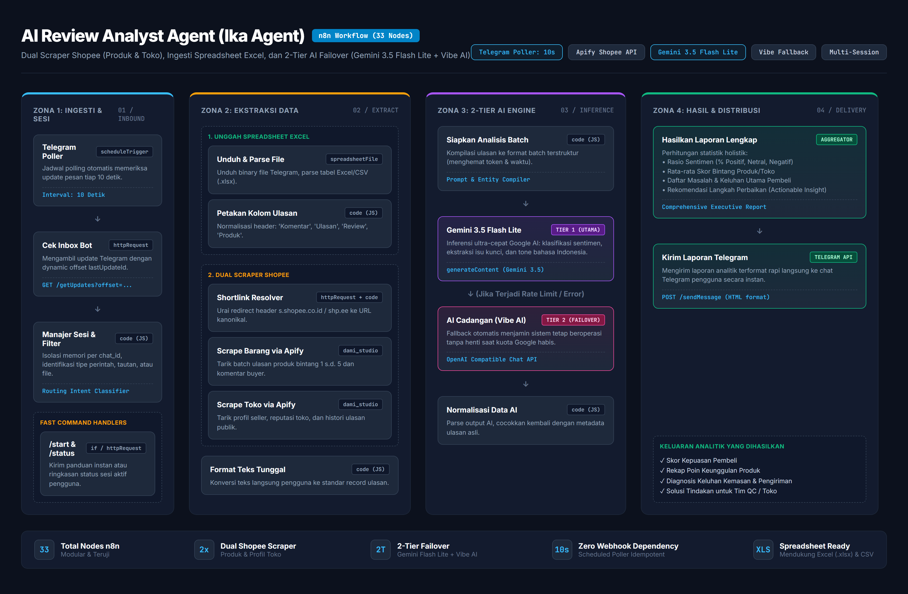

# AI Review Analyst Agent (Ika Agent)
> Multi-Channel E-Commerce Review Scraper & Sentiment Analyst with 2-Tier AI Failover (Shopee, Excel & Direct Input)

<p align="center">
  
</p>

---

## 📌 Ringkasan Proyek

**AI Review Analyst Agent (Ika Agent)** adalah agen otomasi n8n tingkat lanjut yang dirancang khusus untuk menganalisis sentimen ribuan ulasan pelanggan dari berbagai saluran penjualan (e-commerce Shopee, file spreadsheet Excel/CSV, dan input teks langsung via Telegram). 

Sistem ini membantu pemilik brand, manajer produk, dan tim riset pasar mendeteksi kepuasan pelanggan, keluhan berulang, sentimen tersembunyi, serta rekomendasi perbaikan kualitas secara instan dan otomatis tanpa perlu membaca ulasan satu per satu secara manual.

---

## 🌟 Fitur Utama & Keunggulan

1. **Dual Scraper Shopee (Barang & Toko Otomatis):**
   * **Shopee Product Review Scraper:** Mengekstrak seluruh ulasan produk spesifik dari link `shopee.co.id/...-i.xxxx.yyyy`.
   * **Shopee Shop Review Scraper:** Mengekstrak seluruh riwayat reputasi toko langsung dari link profil toko `shopee.co.id/username`.
   * **Smart Shortlink Resolver:** Mendukung shortlink ponsel (`s.shopee.co.id/...` atau `shp.ee/...`), diurai otomatis ke tautan kanonikal sebelum proses scraping.

2. **Multi-Input Ingestion Gateway:**
   * **Unggah Spreadsheet:** Terima file Excel (.xlsx) atau CSV berisi daftar ulasan dari sistem internal Anda.
   * **Tautan Langsung:** Kirim tautan produk atau toko Shopee langsung ke chat Telegram bot.
   * **Teks Manual:** Kirimkan teks ulasan bebas untuk diagnosis instan.

3. **2-Tier AI Failover (Anti-Rate-Limit):**
   * **Tier 1 (Utama):** Google Gemini 3.5 Flash Lite — inferensi super cepat, pemahaman konteks bahasa Indonesia & gaul yang akurat.
   * **Tier 2 (Cadangan):** Vibe AI Chat Completions — otomatis mengambil alih jika API Gemini mengalami limit kuota/error jaringan, menjamin ketersediaan 24/7.

4. **Isolasi Sesi Pengguna & Anti-Bentrok:**
   * Manajemen multi-user berbasis `chat_id` di memori statis n8n (`$getWorkflowStaticData`), mencegah kebocoran data antar pengguna yang mengakses bot secara bersamaan.

5. **Laporan Analitik Komprehensif:**
   * Ringkasan rasio sentimen (Positif, Netral, Negatif).
   * Rata-rata rating bintang dan distribusi kepuasan.
   * Rekap poin kelebihan produk (Kekuatan) & masalah utama (Kelemahan/Keluhan).
   * Saran tindakan strategis untuk tim operasional dan QC.

---

## 🛠️ Tools & Kebutuhan Sistem

| Komponen | Peran | Catatan |
| :--- | :--- | :--- |
| **n8n** | Automation Workflow Engine | Minimal versi 1.80+ / 2.x |
| **Telegram Bot API** | Antarmuka Pengguna (UI/UX) | Dibuat melalui @BotFather |
| **Apify API** | Scraping Engine Shopee | Actor Shopee Product & Shop Reviews |
| **Google Gemini API** | AI Sentiment & Intelligence (Tier 1) | Gemini 3.5 Flash Lite via Google AI Studio |
| **Vibe AI API** | AI Failover Engine (Tier 2) | OpenAI-compatible endpoint |

---

## 🚀 Panduan Instalasi & Konfigurasi

### 1. Buat Bot Telegram
1. Buka aplikasi Telegram, cari `@BotFather`, lalu kirim `/start`.
2. Ketik `/newbot`, ikuti instruksi hingga mendapatkan **Bot Token** (contoh: `123456:ABC-DEF...`).
3. Tempel token ini pada node HTTP Request Telegram di n8n.

### 2. Dapatkan API Key Apify (Scraper Shopee)
1. Buat akun di [Apify Console](https://console.apify.com/).
2. Buka menu **Settings** → **Integrations** → salin **Personal API Token** (`apify_api_...`).
3. Masukkan token ke parameter URL node `Scrape Ulasan Barang via Apify` dan `Scrape Ulasan Toko via Apify`.

### 3. Dapatkan API Key Google AI Studio
1. Kunjungi [Google AI Studio](https://aistudio.google.com/).
2. Buat API Key baru dan salin token `AIzaSy...`.
3. Tempel ke parameter header atau query URL pada node `Gemini 3.5 Flash Lite (Utama)`.

### 4. Import Workflow ke n8n
1. Buka dashboard n8n Anda.
2. Klik menu **Workflows** → **Add Workflow** → pilih menu **Import from File...**.
3. Pilih berkas [`ai-review-analyst-agent.json`](file:///d:/Tools/AIC/n8n/ik%20-%20Copy/ai-review-analyst-agent.json).
4. Aktifkan workflow (**Active / Toggle On**).

---

## 📋 Alur Kerja Pipeline (33 Nodes)

```
[Trigger & Poller]
       │
       ▼
[Telegram Poller (10s)] ──► [Cek Inbox Telegram] ──► [Manajer Sesi & Filter]
                                                               │
  ┌──────────────────┬─────────────────┬───────────────────────┼────────────────────┐
  ▼                  ▼                 ▼                       ▼                    ▼
[/start]        [/status]        [Upload Excel]        [Link Barang Shopee]   [Link Toko Shopee]
  │                  │                 │                       │                    │
[Panduan]       [Info Sesi]      [Parse Sheet]           [Scrape via Apify]   [Scrape via Apify]
                                       │                       │                    │
                                       └───────────┬───────────┴────────────────────┘
                                                   │
                                                   ▼
                                       [Siapkan Batch Analisis]
                                                   │
                                                   ▼
                                       [Gemini 3.5 Flash Lite]
                                                   │
                                         (Failover jika error)
                                                   ▼
                                           [AI Cadangan Vibe]
                                                   │
                                                   ▼
                                       [Normalisasi Data Ulasan]
                                                   │
                                                   ▼
                                       [Hasilkan Laporan Lengkap]
                                                   │
                                                   ▼
                                       [Kirim Laporan ke Telegram]
```

### Rincian 5 Tahapan Utama:

#### 1. Ingesti & Normalisasi (Step 1 - 3)
* **Telegram Poller (Tiap 10 Detik):** Mengambil pesan baru secara berkala.
* **Cek Inbox Telegram Bot:** Menggunakan `offset` dinamis untuk menjamin pesan hanya diproses satu kali (*idempotent*).
* **Manajer Sesi & Filter Input:** Mengidentifikasi tipe perintah, tautan, lampiran, serta mengisolasi state per user.

#### 2. Cabang Pengolahan Sumber Data (Step 4 - 22)
* **File Excel/CSV:** Node `spreadsheetFile` mengekstrak baris data dan memetakan kolom produk serta ulasan secara otomatis.
* **Link Barang Shopee:** Mengirim request ke Apify Scraper untuk mengekstrak ulasan rating bintang 1 sampai 5.
* **Link Toko Shopee:** Menarik ringkasan reputasi toko beserta batch ulasan toko.
* **Shortlink Shopee Resolver:** Melakukan deteksi redirect header `Location` untuk shortlink ponsel.

#### 3. Batching & AI Intelligence (Step 23 - 27)
* **Siapkan Analisis AI Batch:** Mengelompokkan teks ulasan ke dalam payload terstruktur guna menghemat kuota token.
* **Gemini 3.5 Flash Lite (Utama):** Mengeksekusi analisis sentimen mendalam, ekstraksi kata kunci, dan klasifikasi masalah.
* **Gemini Error / Failover?:** Node kondisional yang mendeteksi status HTTP atau error token.
* **AI Cadangan (Vibe):** Cadangan otomatis model LLM untuk menjamin pipeline tidak terputus.

#### 4. Konsolidasi & Rekapitulasi (Step 28 - 29)
* **Normalisasi Data Ulasan:** Menggabungkan output inferensi AI dengan metadata ulasan asli.
* **Hasilkan Laporan Analitik Lengkap:** Menghitung persentase sentimen, ringkasan eksekutif, dan poin rekomendasi perbaikan.

#### 5. Pengiriman Laporan (Step 30)
* **Kirim Laporan ke Telegram:** Mengirimkan hasil analisa lengkap langsung ke pengguna dalam format pesan rapi berstruktur.

---

## 💬 Format Input & Contoh Penggunaan

| Skenario | Contoh Input Telegram | Respon Agent |
| :--- | :--- | :--- |
| **Bantuan** | `/start` atau `/help` | Menampilkan panduan lengkap, cara analisa, dan menu |
| **Status** | `/status` | Menampilkan ID sesi, riwayat analisa, dan status koneksi |
| **Link Barang** | `https://shopee.co.id/product-i.12345.67890` | Konfirmasi scraping barang → Jalankan Apify → Kirim laporan sentimen |
| **Link Toko** | `https://shopee.co.id/nama_toko` | Konfirmasi scraping toko → Jalankan Apify → Kirim rekap ulasan toko |
| **File Excel** | Unggah file `.xlsx` / `.csv` | Unduh file → Parse baris ulasan → Kirim laporan analitik |
| **Teks Ulasan** | *"Barangnya cepat rusak dan pengiriman lambat sekali!"* | Klasifikasi langsung sentimen Negatif & rekomendasi penanganan |

---

## 📄 Lisensi
Didistribusikan di bawah lisensi MIT. Bebas dimodifikasi dan dikembangkan untuk kebutuhan riset pasar maupun integrasi toko online Anda.
